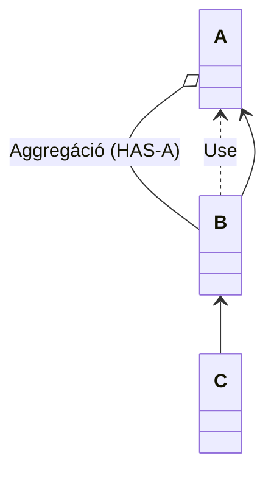

# Vizsga
- 24 tervezési minta
- DIP kötelező
- UML beugró
- TDD
- BDD
- 1-2 kötelező + választott tétel
- ISQB CTFL (CTFL-AT)
- 4 tesztelési technika közül 1-et kell bemutatni
- Boundary value analysis
# SDLC 
SDLC (Software Development Life Cycle)

![[tdd01.excalidraw]]
A terv alapján kell teszteljünk, ott van, hogy mit kell csinálni a programnak, implementációban van megoldva de az nem számít.

SCRUM: Sok kicsit életciklus, előkészítem a tesztelést, a tesztkörnyezetet, tesztterveket.  

## Cypress
Node.js-re épül, weboldalak, mobil alkalmazások tesztjére épül. Felületi tesztekre hasznos. 
`npm install cypress --save-dev`

# BDD
Behavior Driven Development


# Tervezés

Mostanság use case központú. Ez egy forgatókönyv ami megmondja ki mire tudja használni az informatikai rendszer. A kire az actor a mire a funkció válaszol.

Az actor az informatikai rendszeren kívül van, ő használja a rendszert, általában ember de lehet agent, AI vagy egy másik rendszer. 

A use-case ábrák a funk spec részét képzik azaz a tervezés nem a use-case ábrák előállításával indul, hanem a köv spec elkészítésével, tehát előbb vannak követelményeink. A mai tervezés fontos eleme, hogy minden termék visszavezethető legyen a követelményig. A tervezőnek ez fontos feladata. 

Ismétlés (RFT Köv. Spec.): Egy kötelező eleme van, a követelmény lista. Ez egy táblázat, ahol a következő az oszlopok

| ID  | Név   | Leírás       | V   | Tech Megj             | 
| --- | ----- | ------------ | --- | --------------------- |
| K1  | Login | A user belép | 0.1 | Hasonló mint x appban |

Ebből lesznek a use casek
![[tdd02.excalidraw]]
A funk spec-et a tervező írja a megrendelőnek, arra jó hogy a megrendelő eldöntse hogy van-e erre szüksége. A megrendelő és szoftvercég félreérthetik egymást, ezeket csökkentheti a funk spec.

Egy kép felér ezer szóval. Azért rajzoljuk a use case ábrákat, mert a rendelő nem szeret olvasni, csak fontos infót rakjunk az ábrára. 

Érdemes az ábrát sztereotipizálni
![[Drawing 2023-09-13 11.10.41.excalidraw]]

## Emberi eredetű hiba (error)

Félreértés, rossz követelmény értelmezés és emiatt hibás kódsor lesz írva. Amikor ez lefut akkor meghibásodást tud eredményezni, más az elvárttól a működés.

bug szinonimák
4.0 syllabus

Hiba: 
Kiváltó ok:  félreértés
Hatás: felhasználó érzi

### Validáció, verifikáció
Validnálni felhasználói igények ellen kell. (Azt kapja a megrendelő kért?). Megfelelő-e?
Verifikálni a specifikáció ellen kell. (Azt csinálja ami a specifikációban van?). Ellenőrzés

## Hiba (defect)

## Meghibásodás (failure)

## Tesztelés alapelvei

1. A tesztelés a hibák jelenlétét mutatja, nem a hiányukat
2. Nem lehetséges kimerítő teszt (Hoare-kalkulusz)
3. A korai tesztelés időt és pénzt spórol
4. Hibák  hibafürtökben megjelenni
5. Féregirtó paradoxon. Minden változtatás után újra kell futtatni a unit teszteket
6. A tesztelés függ a környezettől
7. A hibamentesség egy téveszme

## Tesztelés

SOLID Elvek 
### DIP - Dependency inversion principle
Akkor van dip ha minden nyíl absztrakcióra mutat



Az asszociáció csak átmeneti. 
Aggregációnál van mező, lehet null értékű.

Barátság leggyakoribb formája hogy kapok egy metódust
Alapvetően procedúrális programozásnál felső szint alsó szintű metódusokat hívogat és ha kiderül ha mégsem audit vezetünk hanem VW-t akkor lehet a felső szintet is meg kell változtatni, mert az alsó szinteken valami részlet változik. Ha valami alacsony szintű rész megváltozik, és nem akarjuk hogy ez megváltoztassa a másik kódot.

Nem a felső függ az elsótól és az alsó a felsőtől, hanem a részletek függenek az absztrakciótól. Az absztrakcióval választom el az alsó szintet a felsőtől. 

Minden nyíl absztrakcióra mutat. A felső szint használja az absztrakciót, az alsó szint megvalósítja.
Pl. nem egy adott autót tudok vezetni, hanem általánosan. 

### Separation of concerns 
Ha valamit szét lehet választani akkor azt érdemes szétválasztani. 

### Inversion of control 
Template method-nél néztük. Lényege, hogy az ős hívja a gyermeket. 

IOC az bármilyen programozás, és ezáltal separation of concerns. 

Case distinction


### Double dispatch

Accept visiot kódja
```java
acceptVisior(Visitor v){
v.visit(this)
}

Visit (nulltree T){
	visit (Node n){
		n.getBal(accceptVisitor(this))
	}
	visit (leaf f){
	}
}
```
A v referencia sum visitorra vagy max visitorra mutathat, ezért futási időben dől el, késői kötés segítségével

