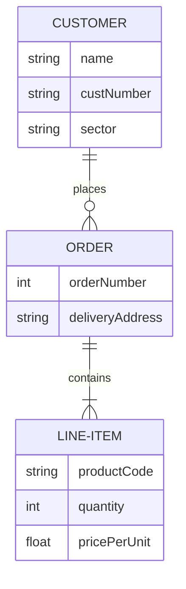

# Use case központú tervezés

RUP (rational unified process) módszertan 3 újítást hozott:
1. elfogadottá tette az iteratív módszertanokat
   (rövid iterációk, )
2. Konfigurálható módszertan megjelenése
   (rugalmasabb módszertanok)
3. Use case alapú vertikális felbontása projekteknek
   (manapság user story)

Fő gondolata minden termék visszavezethető legyen a use case-re.
Mindenképp kell diagram.

Radikálisabb megoldást: nem use casere, hanem követelményekre vezetjük vissza.

## RFT Ismétlés
Vízesés, SSADM, Spirál, Iteratív, Inkrementális
Első iteratív: RUP (1998 körül)
MDA (Model Driven Architecture): nem fejlesztem a software-t hanem csak megtervezem. 
Nem az UML a software tervrajza, hanem a forráskód. Eddig úgy tűnt, hogy muszáj forrás kódot írni. Az AI-ok ezt lehet megváltoztatják. Az AI-ok tervből tudnak tervből programot írni.

RUP után jött a scrum. 
Kanbannal, XP-vel fel lehet javítani a scrum-ot, konfigurálni lehet.
Következő módszer a crystal

Lean módszertan: kanban is ilyen. Csak akkor gyártunk amikor van rendelés. Ha lehet a költséget csökkenteni akkor használjuk. Nem raktározunk, just in time.

### Best Practice

TDD, pair programming, code review, continious integration. 

TDD utódja: BDD, behaviour driven development

CRUD: meg kell tervezni a listázást, pl.: mennyit jelenítsünk, rendezés, mit tartsunk memóriába. 
Felület tervezésekor meg kell írni a tesztelési forgatókönyvet is. Definition of Done

Legalább 5 oldalas esszé amibe egy listát kell tervezni, bővíteni, olvasni, törölni, módosítani. Képernyőterv (screenshotolni lehet) 
ER model: entity relationship model

Úgy kell megtervezni hogy a sok sok kapcsolatot felbontom két egy-sok kapcsolatra.
Figyelni kell arra hogy az egész adatbázist nem lehet memóriába tárolni 

Funkcionális és nemfunkcionális követelmény:
funkcionális: legyen keresés, listázás
nem funkcionális: legyen gyors, szép
mitől lesz szép a keresés?

A business analyst-nek nem kell számítógép, csak meg kell értenie az üzleti folyamatokat. A system analystnál van rendszer, ő javítja fel.

Rugalmas bővíthetés alapja a tervezési minták használata

### DIP
Minden nyíl absztrakcióra mutat, a felső és alsó szintet absztrakcióval választom szét. A két szint nem függ egymástól. A felső szint a szolgáltatásait az alsó szint szolgáltatásaival valősítja meg, úgy, hogy csak a lehetséges alsó szintet.

Bridge tervezési minta: a felületet és a megvalósítást válasszuk szét. . egységbe zárás.

Ha a referenceiát 