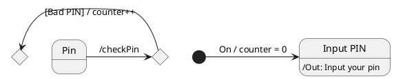

# Startup

- Nagyon gyorsan tud növekedni, 
- kell valami termék
- el kell tudni mondani az ötletet
- Friends, fouls family
- Magvető tőke

Startup eco-system

# Állapotgép
State machine

Állapotok közötti nyilat állapotátmenektnek (transaction), a nyílra azt írom ami az egyik állapotból visz a másikra

esemény[őrfeltétel]/hatás
event[guard]/effect

```java
class BitCounter{
	int counter;
	
	public BitCounter(){
		counter = 0;
		
	}
	public plusOne{
		if (counter=3)
			counter=0;
		else
			counter++;
	}
	
}

```





OTL -> object constraint language

# Alábontás
Minden mai tervezés use case központú, a use-caseket bontom alá, csinálok szekvencia, aktivitási diagramot és állapotgépet, innentől programozók dolga. 

## State Transition Testing

Valid transition: olyan út ami startból stopba vezet, nem pörög loopba, azokat kihagyja

Unit testbe 5 dolog kell:
- target
- fix input 
- expected
- actual
- AssertEquals

```java
public class STT{
	@Test
	public void validTransitionTest2{
		Door target = new Door();
		target.Close();
		target.Open();
		target.Close();
		target.Stop();
		String excepted = "stop";
		String actual = target.getCurrentState();
		assertEquals(expected, target);
	}
	public void validTransitionTest3{
		Door target = new Door();
		target.Close();
		target.Lock();
		target.KeyOpen();
		target.Lock();
		target.Stop();
		String excepted = "stop";
		String actual = target.getCurrentState();
		assertEquals(expected, target);
	}
}
```