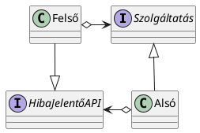

![[rtt01.excalidraw]]
az alsó szintnek értesíteni kell a felső szintet 

hibás működésnél dobunk exception-t
ami runtim exception azt nem kell felsorilni, csak ami simából

## Kommunikáció alsó szintről felső szintre

### 1. megoldás
ha hiba történik az alsó szinten akkor exception-t dobok
   csúnya kód de jól támogatott, ajánlott. Mit kell rakni catchbe? Roll back-elni a stabil állapotba. sikeres tranzakciót committal zárom, sikertelent rollback-elem. Ezt implementálni kell.
2. Újra próbálom
3. Csinálni egy saját egyszerű implementációt
4. minden más

### 2. Visszatérési érték lehet hibakód is

### 3. observer tervezési minta, ha a megfigyelő a felső, akkor az alsóval 

### 4. a felső szint referenciát ad az alsónak
ezzel önmagából ad hibaüzenetet

csak annyit kell láthatóvá tenni az alsó szintnek amennyi a hibát meg tudja jeleníteni

### 5. callback
ugyan az az ötlet, csak nem referenciát adok, C#-ban felső szinten lehet megírni

ajvaban csak enum, interface, class-t lehet irni
veszély: körkörös kommunikáció

Körkörös kommunikáció hátránya: nehezen átlátható, komplex, fordítási függőséget okoz

#### ismétlés

has-a kapcsolatnak több fajtája van
- kompozíció
- aggregáció
- asszociáció (--> {referencia neve} vagy ..> {sztereotípiát kell rá írni, műelet hívása})

SOLID-ban az I betű az ISP:
Interface segregation principle

[Link](https://pastebin.com/YNEzuKA1)

### Körkörös terv
Ha a tervben van kör akkor az egy tervezési hiba. 

Ez legalsó szinten azért rossz, mivel fordítási függőség van. 

#### Funkcionális függőség
Egy mezőnek az értékéből egy másik mező értékét ki tudom találni. pl. személyi számból egy embernek az összes adata.

#### Implementációs függőség
Ha az egyik osztály kódját megváltoztatom a másik osztály kódja is megváltozik.

#### Fordítási függőség
Megváltoztatom az egyik osztály kódját, a másik nem feltétlen változik de újra kell fordítani.

Megoldás: interface

### Command
Az objektum orientált paradigmát két féle képpen lehet megvalósítani: metódus hívással és üzenet küldéssel. Metódus hívás az szinkronkommunikáció. Az üzenet küldés is ugyan olyan erős. Amit az egyikkel meg lehet csinálni azt a másikkal is. 

Metódus hívásnál elküldöm az üzenetet, de nem várom meg a választ. Ez az aszinkron kommunikáció. Ez azért nem jó mert nem fix az események sorrendje és lehet hogy 100-ból csak egyszer hibázik
Előnyei, bégig nálunk van a kommunikáció. sorba lehet rakni az üzeneteket. Van "postás" (request broker).    bármilyen nyelven megírt objektumot lehet küldeni. 

Az üzenet küldést lehet szimulálni C#-ban és Java-ban, ehhez az kell hog a metódus hívást becsomagoljuk egy metódusát. Ez lesz a Command tervezési minta. 

A minta szerint a command-ba csak egy metódus van, az execute. 

Ez arra jó hogy időben szétválassza az két időpillatatot. Az egyik amikor meg van minden infó a híváshoz. A másik amikor megtörténik a hívás. 

Nagyon szeretjük szövegszerkesztőknél, lehet olyan parancsot csinálni ami visszavonható. Menü kezelésnél is nagyon szeretik, a menünek csak annyit kell tudnia ha őt aktiválták akkor hajtsa végre a feladatot.

pl. rátenyerelek billentyűzetre, és megtelítem a puffert.
Érdemes használni:

Példafeladat: van menü rendszer, minden menü ponthoz egy parancsot. 1. menü pont adatrögzítés, második menü pont: lekérdezés, 3. menü pont: törlés. A menü pontok nem tudják mit kell csinálni, csak végre kell hajtani. 

#### DIP szempontjából a command

Tudjuk hogy a dip a separation of concerns kistestvére. Kevésbé durva, de ugyanúgy dolgok szétválasztására jó. Mivel időben elválasztom a dolgokat, ezért a feldolgozó jön a képbe (ami gyakran 1 sor). A feldolgozóba lehet üzleti logika, általában valamilyen szempontból priorizálom a sort, a nagyobb prioritású parancsokat előbbé veszem.

### Értelmező (interpreter)

Szoftver eladással jó pénz lehet szerezni mert jól skálázható. Hanglemezzel elkészíteni a mester hanglemezt drága, de utána legyártani annak a segítségével az újakat már olcsó. Legjobb a dobozos, utána jön a testre szabható, aztán az egyedi. Következő fokozat a keretrendszer. Azalatt a vizuálisan programozható keretrendszerek, ilyen pl. Unity, LabView. Komparatív előny szerzése: hatékonyabban oldod meg a feladatot adott domain-ben mint egy versenytárs. Abból is lehet előny hogy megfelelünk a szabványnak.  
Domain: témakör/terület. Domain knowledge. Arra kell törekedni hogy az osztályok, metódusok nevei egybeessenek a domain szakkifejezéseivel. Magasszintű prog nyelvekbe el lehet jutni erre a szintre, csak nehéz. Úgy hívják ezt hogy DSL(Domain specific languages). Két fajta nyelv van: általános és DSL. Általánosban mindent megtudsz csinálni csak nehezen. DSL-ben adott dolgot könnyű megcsinálni de mást lehetetlen. Pl.: SQL (adatbázis könnyű, játékot lehetetlen)

