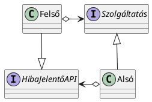

![[rtt01.excalidraw]]
az alsó szintnek értesíteni kell a felső szintet 

hibás működésnél dobunk exception-t
ami runtim exception azt nem kell felsorilni, csak ami simából

## Kommunikáció alsó szintről felső szintre

### 1. megoldás
ha hiba történik az alsó szinten akkor exception-t dobok
   csúnya kód de jól támogatott, ajánlott. Mit kell rakni catchbe? Roll back-elni a stabil állapotba. sikeres tranzakciót committal zárom, sikertelent rollback-elem. Ezt implementálni kell.
2. Újra próbálom
3. Csinálni egy saját egyszerű implementációt
4. minden más

### 2. Visszatérési érték lehet hibakód is

### 3. observer tervezési minta, ha a megfigyelő a felső, akkor az alsóval 

### 4. a felső szint referenciát ad az alsónak
ezzel önmagából ad hibaüzenetet

csak annyit kell láthatóvá tenni az alsó szintnek amennyi a hibát meg tudja jelenítani

### 5. callback
ugyan az az ötlet, csak nem referenciát adok, C#-ban felső szinten lehet megírni

ajvaban csak enum, interface, class-t lehet irni
veszély: körkörös kommunikáció

Körkörös kommunikáció hátránya: nehezen átlátható, komplex, fordítási függőséget okoz

ismétlés

has-a kapcsolatnak több fajtája van
- kompozíció
- aggregáció
- asszociáció (--> {referencia neve} vagy ..> {sztereotípiát kell rá írni, műelet hívása})

SOLID-ban az I betű az ISP:
Interface segregation principle

[[pastebin.com/YNEzuKA1]]
[Link](https://pastebin.com/YNEzuKA1)
