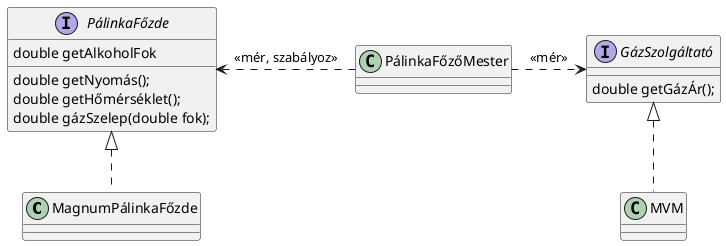

# Szabályozási régió
Ma a visszacsatolásról beszélünk
## Vezérléstechnika
Van a fizikai valóság, de az túl részletes ezért méréseket kell csinálni amik nem pontosak. Viszont van szabályozott érték amin belül kell maradni. Ezért vannak szenzorok, amiktől lesz a visszacsatolás (pl. melegítés, adott elem beindítása, mozgás). Valamit sinálok ami ráhat a valóságra, utána mérem az értéket, ez a visszacsatolás(feedback).
Van a visszacsatolás és az előrecsatolás(feed forward). 
Két környezet:
- belső környezet, erre van ráhatása (pálinka főzde belseje)
- külső környezet: nincs ráhatás (földrengés, gázcsap elzárása)

Pálinkafőzdénél:
- belső esemény: matéria hőfoka nő/csökken, alkohol térfogat nő/csökken
- külső esemény: gáz árának változása
Az események véletlenszerűek, az a fekadatok, hoyg az értékeket a szbályozott tratjuk
Feed forward: mérem a küldős könryezetet és annak alapján változtatom 
Feed backmérem a belső körnezetet és aszerint változtatom

Szaggatott nyílra lehet írni sztereotípiát, de folyamatosra nem, mert a folyamatos nyílon az a mező nevét (ami a kapcsolatot megvalósítja). Ez egy olyan fajta kapcsolat ahol a mérés.

Mérni tudjuk a külsőt és a belsőt is, de szabályozni csak a belsőt tudjuk. Pl. hőfok növelése.

Uncle Bob (Robert c. Martin) egy korai cikkében azt írta (még mielőtt híres lett), hogy a szoftver tervrajza az a forráskód, csak a forráskód elég részletes ahhoz hogy szoftver lehessen fordítani.
Volt régen egy álmunk, ez volt az MDA (Model Driven Architecture). Elég a szoftvert megtervezni, venni valami új terméket, megnyomni a gombot és kész a termék. De kiderült, hogy az UML nem elég részletes. 
UML csak arra jó, hogy az ötleteinket leskicceljük, és a dokumentum. Tervezőknek kell ismerni, programozóknak csak az osztálydiagrammot. Legjobb barátunk az állapotgép. 
Business Process Model and Notation, ezt a folyamat mérnököknek kell ismerni. 

A közhangulat kezd visszaállni arra, hogy többet dokumentáljunk. Pár évvel ezelőtt az agilitás azt jelentette, hogy a lehető legkevesebbet dokumentálok, mert úgyse olvassa el senki, csak teszteket írok és user sztorikat Most már nem csak víziót írok hanem csinálok roadmap-et, leírásokat, BDD-t. Az inga éppen a craftsmanship-nél (jó munkásember) áll, a heavy és a lightweight között, a light-hoz közelebb. A programozói craftsmanship-pel azt értjük, hogy törekszünk a minőségre, elismer, hogy vágtat a technológia és csak akkor tud rajta maradni, hogyha képzi magát, és nem várjuk el a cégtől, hogy elküldjön tanfolyamra, hanem magamtól tanulom. Előbb utóbb úgyis lemaradunk. Jó munkásember az dokumentál, a git commit message-t, próbálja a saját kódját olvashatóan írni.

