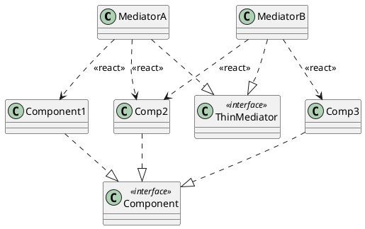
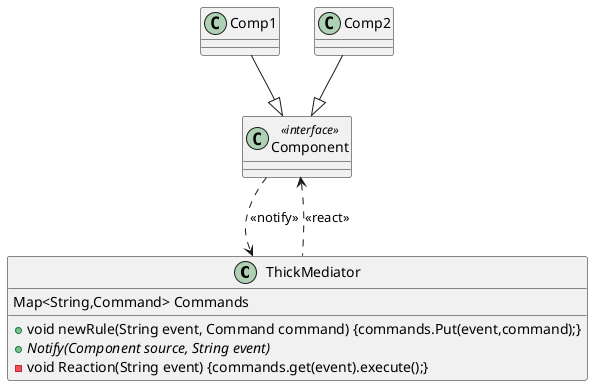

# Mediátor

Okosháznál jön szóba, okoskávéfőző, okosredőny, okos rádió. 
Ezekbe lehet szabályrendszereket kialakítani. Pl. reggel 6kor főzzön le a kávé, 6:05-kor kapcsolódjon be a rádió és 6:10-kor a világítás. Ehhez eseményeket kell tudnom csinálni, és ezeknek hatását kell leírnom. Reaction: van valami történés és arra kell reagálni.  Az eseményre adott reakció 0 vagy több parancs. Tehát a parancsnál nem kell tudnom azt, hogy kinek szól a parancs, mert a parancsba már bele van égetve, hogy kinek szól. Ez jó megoldás arra hogy a mediátor rugalmas tudjon lenni, csak végre kell hajtani.

Mediátorral lehet regisztrálni az eszközöket, ahhoz kapcsolódóan parancsokat lehet készíteni, asz eszközök eseményeket válthatnak ki, és az azok által kiváltott események, az események meg reakciót válthatnak ki ami 0 vagy több parancsot adhat. 

Van sovány és kövér mediátor.
Vékonyban `értesít` metódus van, és azon keresztül fogadom az eseményeket. 2 paramétere van: melyik eszközről jön az esemény (forrás) és esemény leírása (ez egy string). Az observer-ből ismerős az értesít. Amikor az eszköz feliratkozik a mediátorhoz, akkor a mediátor elkezdi figyelni az eszközt, amikor az eszköz kivált egy eseményt arról értesül a mediátor. A vékony mediátorban nem ad receptet arra, hogy a reakciókat hogyan kell leprogramozni. Lehet interface. 

A vastag mediátorban 3 metódus van: értesít (ugyan az mint az előbb), új szabály (eseményhez kötök parancsokat) és reakció (egye paraméter: `string esemény)`. Ha eseményhez csak 1 szabályt köthetek. A reakció megnézi a disctionary-ben levő aprancsokat és azokat végrehajta. Sajnos a vastag mediáator nem lehet interface, mert kell hozzá dictionary, ami egy mező, de ezt interfaceben nem lehet példány szintű mező. Interface-t azért találták ki, mert nincs többszörös öröklődés.

Interface-nél van a default kulcsszó, amivel meg lehet adni törzset, és azután azt nem muszáj fekökírni. C#-ban meg lehet csak írni 8.0 .net verzió után.

Abstract osztály cserélése interfacere
```java
abstract class Ember{
	int életkor;
	public bool fiatalKorú(){
		return életkor<18;
	}
}

interface Ember{
	int getÉletkor();
	
	default bool fiatalKorú(){
		return getÉletkor()<18;
	}
}
```

Java-ban can a thread osztály és runnable interface. Nem minding lehet a thread az ősosztály, de a runnable-t bármikor meg lehet valósítani, rugalmasabb és ezért jobb az interface.




Vastag mediátor


A notify-nak két inputja van, a source és event, a reaction-nek viszont csak event paramétere van.
OCL: Object constraint language

Abban a tervben van kör, ezért nem jó
pl. kész a kávé -> főzz kávét (ez végtelen ciklus)

Ezért kell itt az interpreter tervezési mintát használni, mivel a köröket nem engedhetjük meg. 

Tehát az okos háznak lehet saját nyelve, ezen a nyelven lehet elmondani, hogy milyen nyelven lehet aktiválni. Amikor kész az a nyelv akkor validáltatni kell, meg kell nézni van-e benne kör.

```java
Class SmartCoffeMachine implements Component {
	ThickMediator tm;
	void BrewCoffee(String type, double strenght){
		String coffe = "Your " + type + " is ready, with a strenght of " + strenght
		return coffee;
	}
}

Class BrewCoffeeCommand implements Command{
	SmartCoffeMachine cm;
	String type;
	double strenght;
	public String execute(){
		return kf.BrewCoffe(type, strenght)
	}
}
```


