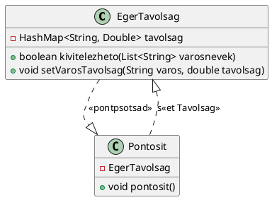
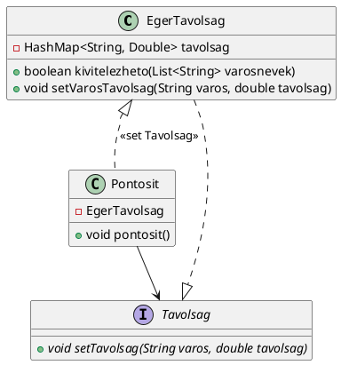
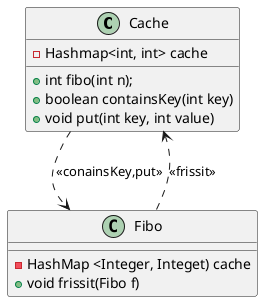
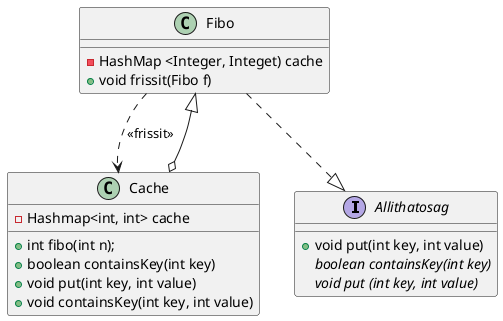

TDD-vel fejlesszük le a következő feladatot: 

Osztály neve: EgerTávolság
Eger-X város közti távolságot egy hashMap-ben tárolom, ahol a kulcs a város neve, az érték a távolság km-ben

Minden kalkuláció előttmeghívjuk a `Pontosít.pontosít` metódust, ami a szokásos setterek segítségével beállítja, ha valamelyik város közúton közelebb vagy távolabb került pl. út karbantartás miatt. Ezt felolvas egy TXT-t, amiből látja a friss értékeket

írjon egy `bool kivitelezhető(list<string> városNevek` metódust, ha a városok kevesebb mint 500 km-re vannak egertől, egyébként hamisat

Ha a paraméter null akkor saját kivételt kell dobjon







## 2. feladat
Kezítssünk egy fibo osztály amelymp hashmap tárol néhány fibonacci számot, ahol a kulcs sortszámaaz maga at.fibo számok2, 3,


miden hívás előtt megnézzük a cache-t, ha a cacheben van olyan kulcs, 

Rossz:




## 3. feladat
TDD segítségével fjlesssze le:
haszbáljon cagy paraméterest vagy repeated tested
ÉletkorAlapúOsztáyba Sorol
-1 vagy alatta - hib
0-2 csecsemő
, 3-6 kisgyerek, 7-12 gyerek, 13-18, 19-25 fitatl fenőtt, 25-65 felnott, 120 + hiba

```java
class EletkorAlapuOsztaly{
	String getOsztaly(int Eletkor) {}
}
```
getosztály(életkor) hívás előtt meghívjuk az aktuális elnevezés osztály egy példányából metúdust, ami visszahívja a setelneevzést(int minEletkor, int maxEletkor, String elnevezes) metódust
Ez körkörös lesz, ezért az equals ét hashcode-ban


