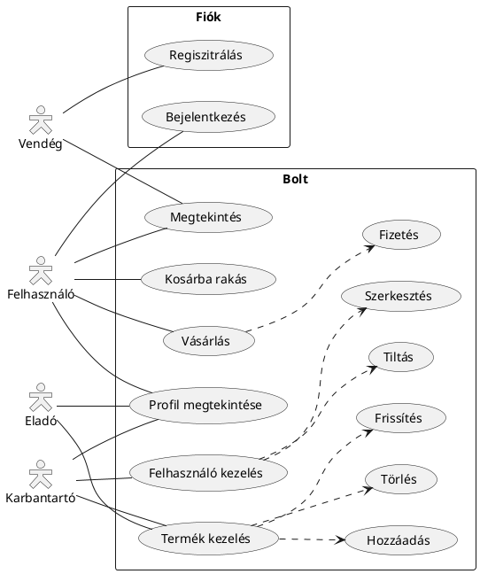

```plantuml
@startuml
skinparam actorStyle Hollow
left to right direction

actor Felhasználó as user
actor Karbantartó as admin 
actor Eladó as seller
actor Vendég as guest

rectangle Fiók{
	user -- (Bejelentkezés)
	guest -- (Regiszitrálás)
}

rectangle Bolt{
	guest -- (Megtekintés)
	user -- (Megtekintés)
	user -- (Kosárba rakás)
	user -- (Vásárlás)
	user -- (Profil megtekintése)
	seller -- (Termék kezelés)
	seller -- (Profil megtekintése)
	admin -- (Profil megtekintése)
	admin -- (Felhasználó kezelés)
	admin -- (Termék kezelés)
	(Termék kezelés) ..> (Frissítés)
	(Termék kezelés) ..> (Hozzáadás)
	(Termék kezelés) ..> (Törlés)
	(Felhasználó kezelés) ..> (Tiltás)
	(Felhasználó kezelés) ..> (Szerkesztés)
	(Vásárlás) ..> (Fizetés)	
}
@enduml
```

